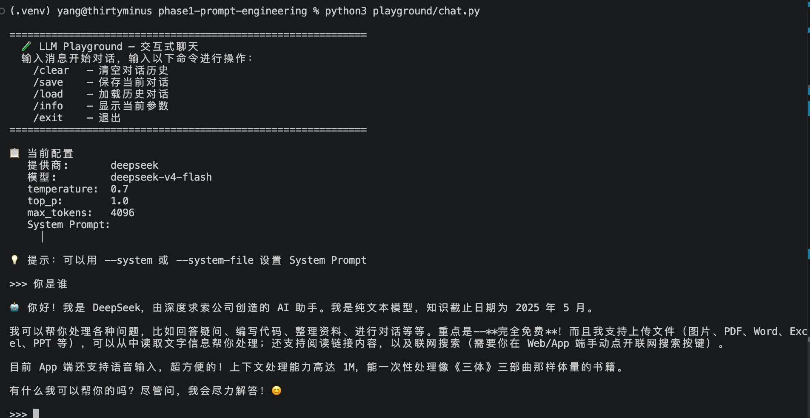

# 阶段一：API 调用与提示工程

> 掌握 LLM API 使用、参数控制、结构化输出，系统训练提示工程思维。

---

## 学习目标

- [ ] 理解 LLM API 的基本调用方式（Completion / Chat）
- [ ] 掌握关键参数：`temperature`、`top_p`、`max_tokens`、`stop`
- [ ] 学会设计有效的 System Prompt 和 User Prompt
- [ ] 实现结构化输出（JSON Mode / Function Calling）
- [ ] 掌握 Few-Shot、Chain-of-Thought 等提示技巧
- [ ] 构建自己的提示模板库

---

## 核心概念

### 1. Chat 模型的消息结构

```
System    → 设定角色、行为边界、输出格式
User      → 用户的输入 / 问题
Assistant → 模型的回复（可手动提供作为 Few-Shot 示例）
```

三者的顺序和角色决定了对话的上下文语义。一个清晰、精准的 System Prompt 往往是输出质量的分水岭。

### 2. 关键参数

| 参数 | 作用 | 典型范围 | 说明 |
|------|------|---------|------|
| `temperature` | 控制输出的随机性 | 0.0 ~ 2.0 | 越低越确定（适合代码/事实类），越高越有创造力 |
| `top_p` | 核采样 — 累积概率阈值 | 0.0 ~ 1.0 | 与 temperature 二选一调优，通常不同时使用 |
| `max_tokens` | 单次回复最大 token 数 | 依模型而定 | 防止无限生成，也影响输出完整性 |
| `stop` | 停止序列 | 字符串或数组 | 遇到指定 token 时停止生成 |
| `frequency_penalty` | 频率惩罚 | -2.0 ~ 2.0 | 越高越避免重复用词 |
| `presence_penalty` | 存在惩罚 | -2.0 ~ 2.0 | 越高越鼓励引入新话题 |

### 3. 提示技巧速览

| 技巧 | 适用场景 | 示例 |
|------|---------|------|
| **Zero-Shot** | 简单明确的指令 | "将以下文本翻译为英文：" |
| **Few-Shot** | 格式复杂或需要示例参考 | 给出 2~3 个输入输出对再提问 |
| **Chain-of-Thought** | 推理/数学/逻辑问题 | "让我们一步步思考" |
| **Role Prompting** | 需要特定视角或风格 | "你是一名资深律师" |
| **JSON Mode** | 需要结构化数据输出 | "请以 JSON 格式回复" |
| **Step-back** | 需要先理解原理再回答 | "先解释背后的原理，再回答问题" |

---

## 代码结构

```text
phase1-prompt-engineering/
├── README.md                 # 本文件 — 阶段一总览
├── playground/               # 交互式聊天工具
│   ├── requirements.txt      # 依赖
│   └── chat.py               # CLI 聊天客户端（流式 + 参数控制）
└── prompts/                  # 提示模板库
    ├── prompt_templates.md   # 按场景分类的模板
    └── examples.md           # 实战案例
```

---

## 前置准备

### 1. 获取 API Key

注册 DeepSeek 并获取 API Key：

- **DeepSeek** — https://platform.deepseek.com/api_keys

也可以用 `--provider openai` 或 `--provider anthropic` 切换到其他模型，本工具同时支持 OpenAI 和 Anthropic。

### 2. 设置环境变量

```bash
# DeepSeek（默认）
export DEEPSEEK_API_KEY="sk-xxx"
```

### 3. 创建虚拟环境并安装依赖

```bash
cd phase1-prompt-engineering

# 创建虚拟环境（每个阶段独立，互不污染）
python3 -m venv .venv

# 激活
source .venv/bin/activate

# 安装依赖
pip install -r playground/requirements.txt
```

> **国内加速：** 如果直接 `pip install` 速度慢，可选用以下方式之一：
>
> **方式一：镜像源（推荐）**
> ```bash
> # 永久配置（一次生效）
> pip config set global.index-url https://pypi.tuna.tsinghua.edu.cn/simple
>
> # 或单次使用
> pip install -r playground/requirements.txt -i https://pypi.tuna.tsinghua.edu.cn/simple
> ```
>
> **方式二：代理**
> ```bash
> pip install --proxy http://127.0.0.1:7890 -r playground/requirements.txt
> ```

### 4. 运行聊天工具

```bash
python3 playground/chat.py
```



---

## 实践路线

1. **跑通基础调用** — 用 `chat.py` 发一条简单消息，观察返回
2. **调整参数** — 分别试 `temperature=0` 和 `temperature=1.5`，感受差异
3. **设计 System Prompt** — 给它一个角色（面试官/导师/翻译），看看回答风格的变化
4. **Few-Shot 实验** — 在 prompts 中找几个模板，对比 Zero-Shot 和 Few-Shot 的输出质量
5. **JSON Mode** — 让模型输出结构化的 JSON 数据，体验可解析性
6. **Chain-of-Thought** — 出一个逻辑题，对比直接回答与"让我们一步步思考"的回答

---

## 常见陷阱

- **temperature 太高导致幻觉**：事实性问题尽量用 0~0.3
- **Stop 序列没设**：模型可能继续生成不需要的内容
- **System Prompt 太短**：只写一句话等于没写，给出明确的边界和格式
- **JSON Mode 不设 Schema**：模型可能输出意料之外的字段结构
- **忘记设 max_tokens**：长回复可能被截断

---

## 参考资料

- [DeepSeek API 文档](https://platform.deepseek.com/api-docs)
- [OpenAI Prompt Engineering Guide](https://platform.openai.com/docs/guides/prompt-engineering)
- [Anthropic Prompt Engineering Guide](https://docs.anthropic.com/en/docs/build-with-claude/prompt-engineering)
- [Learn Prompting](https://learnprompting.org/)