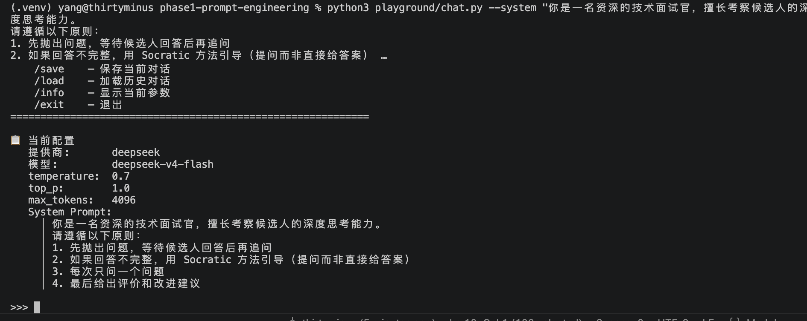
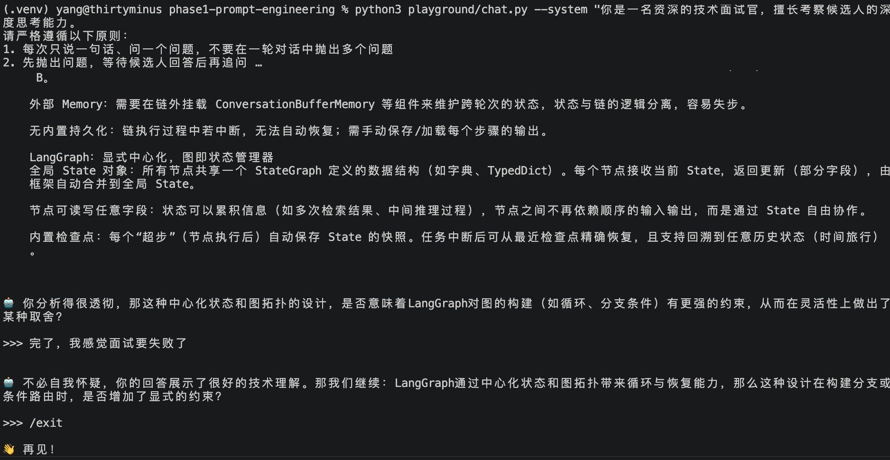

# 提示工程实战案例

> 通过对比实验展示不同提示策略对输出质量的影响。

---

## 案例一：Zero-Shot vs Few-Shot

### 场景：提取邮件中的待办事项

**Zero-Shot 提示：**
```
从以下邮件中提取待办事项：
"张总您好，关于Q2汇报，需要你准备三样东西：销售数据看板需要在周三前完成，竞品分析报告最晚周五给我，还有下周一的项目评审会的PPT也别忘了。辛苦了。"

回复：
```

**输出问题：** 模型可能用自然语言回复而非结构化格式，遗漏事项或混淆时间。



---

**Few-Shot 提示：**
```
从以下邮件中提取待办事项，以列表格式输出。

示例：
邮件："请在本周五前完成预算表，下周一安排团队会议"
输出：
- [ ] 完成预算表（截止：本周五）
- [ ] 安排团队会议（截止：下周一）

现在处理这封邮件：
"张总您好，关于Q2汇报，需要你准备三样东西：销售数据看板需要在周三前完成，竞品分析报告最晚周五给我，还有下周一的项目评审会的PPT也别忘了。辛苦了。"

输出：
```

**改进效果：** 通过 2 个示例，模型准确输出结构化待办列表，格式与示例保持一致。



---

## 案例二：无角色 vs 角色 Prompting

### 场景：获取职业建议

**无角色提示：**
```
我想转行做 AI 工程师，该从哪些方向准备？
```

**输出问题：** 回答可能过于笼统，缺乏针对性。

---

**角色 Prompting：**
```
你是一名有 8 年经验的 AI 工程师，曾在互联网大厂和创业公司都工作过。
现在有一个朋友想转行做 AI 工程师，请根据你的亲身经历给出建议，包括：
1. 需要掌握的核心技能和优先级
2. 推荐的学习路径和资源
3. 简历和面试准备的建议
4. 常见坑点
```

**改进效果：** 回答从"给一个标准答案"变为"基于经验的分享"，实操性强得多。

---

## 案例三：直接提问 vs Chain-of-Thought

### 场景：逻辑推理题

**直接提问：**
```
李华的爸爸有三个儿子：大儿子叫大毛，二儿子叫二毛，三儿子叫什么？
```

**输出问题：** 模型容易顺着"大毛、二毛"的规律惯性输出"三毛"。

---

**Chain-of-Thought：**
```
李华的爸爸有三个儿子：大儿子叫大毛，二儿子叫二毛，三儿子叫什么？
请一步步推理，再给出答案。
```

**改进效果：** 模型在推理过程中会识别出"李华的爸爸"这个关键信息，意识到第三子就是李华本人。

---

## 案例四：非结构化 vs JSON Mode

### 场景：生成商户信息

**非结构化提示：**
```
帮我介绍一家北京海淀区的咖啡店，包括店名、地址、评分和特色。
```

**输出问题：** 模型用散文形式回复，信息难以程序化解析。

---

**JSON Mode：**
```
请生成一家虚构的咖啡店信息，以 JSON 格式输出，不要包含 markdown 标记。
结构如下：
{
  "name": "店名",
  "address": "地址",
  "rating": 评分（浮点数）,
  "price_level": "低/中/高",
  "features": ["特色1", "特色2"],
  "recommended_drinks": ["推荐饮品1", "推荐饮品2"]
}
```

**改进效果：** 输出为可解析的 JSON，可直接用于前端展示或写入数据库。

---

## 案例五：浅 System Prompt vs 深 System Prompt

### 场景：代码审查

**浅 System Prompt：**
```
你是一名代码审查员。
```

**输出问题：** 回答只有一两句"代码看起来没问题"或"这里可以优化"，缺乏系统性。

---

**深 System Prompt：**
```
你是一名严格的代码审查员。
审查标准：
1. 安全性：是否存在注入、权限泄露、敏感信息硬编码
2. 可维护性：命名是否清晰、函数是否过长、是否有重复代码
3. 性能：是否有不必要的循环、缓存缺失、N+1查询
4. 错误处理：边界情况和异常是否被正确处理

对每个问题，请给出：
- 问题描述
- 影响评估（严重/中等/建议）
- 修复建议（附代码示例）
```

**改进效果：** 输出变成了结构化的审查报告，覆盖多个维度且有具体的修复建议。

---

## 动手实验

在你本地使用 `chat.py` 复现以上对比：

```bash
cd phase1-prompt-engineering

# 试 Zero-Shot
python3 playground/chat.py --prompt "从邮件中提取待办：销售数据看板周三前完成..."

# 试 Few-Shot（带上模板中的示例）
python3 playground/chat.py --system-file prompts/prompt_templates.md

# 调参数感受差异
python3 playground/chat.py --temperature 0
python3 playground/chat.py --temperature 1.5
```

建议每次只改变一个变量（提示策略 / 参数 / 角色），记录输出，对比分析。
