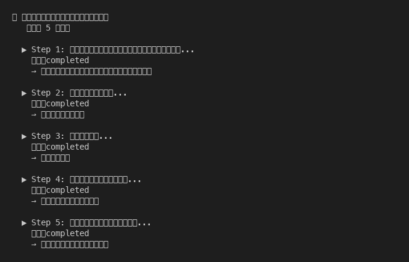
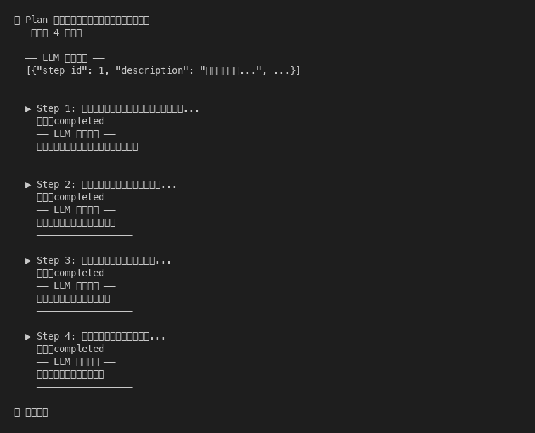

# 阶段四：推理、规划与技能化

> 让 LLM 从"直接回答"到"深思熟虑"—— 引入 Chain-of-Thought、自一致性推理、Plan-and-Execute，以及技能注册表体系。  
> 这是在 Agent 有了工具（阶段三）之后，让它学会"怎么用工具"的关键一步。

`Python 3.10+` · `MIT License`

---

## 一、为什么需要推理与规划？

阶段三实现的 ReAct Agent 已经能做到"边想边做"，但它有一个问题：**每次只思考一步。**

对于一个简单的"查天气"任务，ReAct 足够了。但面对"规划一次旅行"、"写一份技术方案"、"分析一份财报"这类任务，逐步骤的贪婪策略会导致：

1. **局部最优**：每一步都只做当下最好的选择，忽略了全局目标
2. **不可回溯**：一旦方向偏了，之前的推理就白费了
3. **缺乏结构**：无法展示完整的推理链路，难以调试和信任

推理（Reasoning）和规划（Planning）要解决的就是这些问题。

---

## 二、核心概念

### 2.1 推理模式

#### Chain-of-Thought（CoT）

让模型在给出答案之前先输出推理步骤。这不是"魔法"，而是通过给模型一个"思考的空间"来激活它的中间推理能力。

```
普通提问：
Q: 李华有 5 个苹果，给了小明 2 个，又买了 3 个，现在有几个？
A: 6 个。

CoT 提问：
Q: 李华有 5 个苹果，给了小明 2 个，又买了 3 个，现在有几个？
A: 李华最初有 5 个苹果。给了小明 2 个后，剩下 5 - 2 = 3 个。
   又买了 3 个，所以现在有 3 + 3 = 6 个。
   所以答案是 6 个。
```

**关键发现**：CoT 的效果在复杂推理任务上提升显著，而代价仅仅是多写几个字的 Prompt。

#### Self-Consistency（自一致性）

CoT 的升级版：**同一个问题问多次，取最一致的答案**。

```
Q: 23 * 17 = ?

推理路径 1: 20 * 17 = 340, 3 * 17 = 51, 340 + 51 = 391 → 391
推理路径 2: 23 * 10 = 230, 23 * 7 = 161, 230 + 161 = 391 → 391
推理路径 3: 23 * 20 = 460, 460 - 23 * 3 = 460 - 69 = 391 → 391

投票结果：391（3/3 一致）
```

如果模型用不同路径得出同一个结论，我们可以大大增加对结果的信心。

#### Tree-of-Thought（ToT）

CoT 是一条直线，ToT 是一棵树。模型在每一步探索多个可能的推理分支，然后评估哪些分支最有希望。

```
问题：设计一个新产品定价策略
├─ 分支 A：成本导向定价
│   ├─ 基于固定成本 + 利润率
│   └─ 基于变动成本 + 目标回报
├─ 分支 B：价值导向定价
│   ├─ 基于客户感知价值
│   └─ 基于竞品对比
└─ 分支 C：竞争导向定价
    ├─ 低于市场均价
    └─ 差异化定位溢价

→ 评估后选择：B2（价值导向 + 竞品对比）
```

ToT 的代价是多次 LLM 调用，适合需要创造性探索的高价值决策。

### 2.2 规划模式

#### Plan-and-Execute

把"思考"和"行动"分成两个阶段：

1. **Plan 阶段**：先让 LLM 生成完整的执行计划（步骤列表）
2. **Execute 阶段**：逐个执行步骤，每步失败时可重新规划

```
用户：帮我写一份竞品分析报告

Plan 阶段：
  步骤1：确定分析框架（SWOT / 波特五力）
  步骤2：收集竞品数据
  步骤3：对比关键指标
  步骤4：输出分析结论

Execute 阶段：
  ▶ Step 1: 选择了 SWOT 框架 → 完成
  ▶ Step 2: 收集了 3 家竞品数据 → 完成
  ▶ Step 3: 发现数据不完整 → 触发 replan
     ↳ 调整：增加数据收集步骤
  ▶ Step 3（重编）: 基于现有数据对比 → 完成
  ▶ Step 4: 输出报告 → 完成
```

相比 ReAct，Plan-and-Execute 适合**需要全局视野**的任务——先看全貌再动手。

#### 动态重规划

现实任务很少一帆风顺。Plan-and-Execute 的核心竞争力在于：

- **失败感知**：步骤执行失败时识别问题
- **局部调整**：不推翻整个计划，只修正受影响的部分
- **进度保留**：已完成步骤的结果不会浪费

### 2.3 技能化

工具（Tool）解决的是"能不能做"的问题。技能（Skill）解决的是"做得怎么样"的问题。

**工具 vs 技能：**

| 维度 | 工具 | 技能 |
|------|------|------|
| 粒度 | 单原子操作 | 复合能力单元 |
| 输入 | 简单参数 | 可能是整个上下文 |
| 依赖 | 无 | 可依赖其他技能 |
| 组合 | 手动编排 | 注册表自动解析 |

**技能注册表的核心能力：**

- **注册**：将技能纳入全局索引
- **发现**：按名称或关键词搜索可用技能
- **依赖解析**：基于拓扑排序确定执行顺序
- **管道执行**：前一步的输出自动喂给下一步

```
技能注册表：
├─ summarize（文本摘要）
├─ translate（翻译）
├─ format（格式化）
├─ extract_keywords（关键词提取）
├─ count（文本统计）
└─ analyze（全分析 → 依赖 count + summarize + extract_keywords）
```

当 Agent 接到"分析这段文本"的指令时，不需要手动编排 summarize → count → extract_keywords，只需要调用 `analyze` 技能，注册表自动解析依赖，按正确顺序执行。

---

## 三、准备工作

### 1. 进入目录

```bash
cd phase4-reasoning-planning-skills
```

### 2. 设置 API Key（可选）

本阶段默认使用模拟 LLM，无需 API Key 即可运行所有示例。

如需使用真实推理能力，设置 DeepSeek API Key：

```bash
export DEEPSEEK_API_KEY="sk-你的密钥"
```

> 注册地址：https://platform.deepseek.com/api_keys

### 3. 安装依赖

```bash
python3 -m venv .venv
source .venv/bin/activate

pip install -r planner/requirements.txt
pip install -r skills/requirements.txt
```

> 国内加速：`pip install -i https://pypi.tuna.tsinghua.edu.cn/simple -r planner/requirements.txt`

### 4. 验证安装

使用 heredoc 避免引号转义问题：

```bash
# 测试规划器（走 mock，无需 API Key）
python3 << 'EOF'
from planner import SimplePlanner; p = SimplePlanner()
print('Planner OK:', len(p.run_all('test')))
EOF

# 测试技能系统
python3 << 'EOF'
from skills import SkillRegistry; print('Skills OK')
EOF
```

看到 "Planner OK" 和 "Skills OK" 就说明环境就绪。

---

## 四、代码结构

```
phase4-reasoning-planning-skills/
├── README.md                     # 本文档
├── planner/                      # 规划系统
│   ├── __init__.py               # 模块入口
│   ├── base_planner.py           # Planner 抽象基类
│   ├── simple_planner.py         # 简单顺序规划器
│   ├── plan_execute_agent.py     # Plan-and-Execute Agent
│   ├── travel_planner.py         # 旅行规划示例
│   ├── _mock_llm.py              # 模拟 LLM（无 API Key 回退）
│   └── requirements.txt          # 依赖
└── skills/                       # 技能系统
    ├── __init__.py               # 模块入口
    ├── skill_base.py             # 技能基类
    ├── skill_registry.py         # 技能注册表
    ├── builtin_skills.py         # 内置示例技能
    └── requirements.txt          # 依赖
```

---

## 五、规划器实现

### 抽象基类

所有规划器继承同一个接口，方便切换和对比：

```python
class BasePlanner(ABC):
    @abstractmethod
    def plan(self, goal: str, **kwargs) -> list[dict]:
        """根据目标生成步骤规划"""
        pass

    @abstractmethod
    def execute_step(self, step, context) -> dict:
        """执行单个步骤"""
        pass

    def replan(self, goal, steps, completed, failed_step, context) -> list[dict]:
        """失败时重新规划（可选重写）"""
        return steps
```

### SimplePlanner：最简单的顺序规划

适合步骤依赖明确、无需动态调整的场景。自动适配 LLM：

```python
# 无 DEEPSEEK_API_KEY → 规则分解
planner = SimplePlanner()
results = planner.run_all("写一份技术方案")

# 有 Key → 自动用 LLM 分解
planner = SimplePlanner()
results = planner.run_all("写一份技术方案", verbose=True)

# 也可显式传入自定义 llm_fn
from planner.simple_planner import _default_llm
planner = SimplePlanner(llm_fn=_default_llm)
results = planner.run_all("写一份技术方案", verbose=True)
```

### PlanExecuteAgent：真正的 Plan-and-Execute

三个核心阶段：

**1. Plan 阶段**：用 LLM 生成结构化步骤列表

```python
prompt = "请将「写一份竞品分析报告」分解为 3~6 个可执行的步骤..."
# → LLM 返回 JSON 步骤列表
```

**2. Execute 阶段**：逐步骤执行，前一步的结果注入后一步

```
Step 1 → 输出 → 作为 Step 2 的上下文 → Step 2 → 输出 → ...
```

**3. Replan 阶段**：某步失败时，让 LLM 重新规划剩余步骤

```python
# 有 DEEPSEEK_API_KEY → 自动用 LLM，否则回退到 mock
agent = PlanExecuteAgent()

# 安静模式（只返回结果）
result = agent.run("帮我规划一次产品发布会")
print(result["final_output"])

# 详细模式：打印执行过程 + LLM 原始思考内容
agent.run("帮我规划一次产品发布会", verbose=True)
```

### TravelPlanner：规划实战案例

演示 Chain-of-Thought 推理在规划类任务中的应用。内置了 4 个城市的知识库，能从用户的自然语言中提取目的地、天数、预算。

```
📋 输入："去成都玩4天，预算6000，喜欢美食"

🗺️ 分析：成都 / 4天 / 6000元 / 美食偏好
├─ 步骤1：分析约束条件（天数、预算限制）
├─ 步骤2：规划每日行程框架（第一天熊猫基地...）
├─ 步骤3：预算分配（交通1800 / 住宿2100 / 餐饮1200...）
└─ 步骤4：生成完整行程单（含推荐餐厅和注意事项）
```

---

## 六、技能注册表实现

### 技能基类

```python
class BaseSkill(ABC):
    name: str = ""               # 全局唯一
    description: str = ""        # 发现用
    version: str = "1.0.0"      # 版本管理
    dependencies: list[str] = [] # 依赖的其他技能

    @abstractmethod
    def execute(self, **kwargs) -> Any:
        pass
```

### 注册与发现

```python
from skills import SkillRegistry
from skills.builtin_skills import *

registry = SkillRegistry()
registry.register(SummarizeSkill())
registry.register(TranslateSkill())

# 发现
all_skills = registry.list_all()       # 全部技能列表
found = registry.search("翻译")        # 关键词搜索
translate = registry.get("translate")  # 精确查找
```

### 依赖解析与管道执行

当多个技能之间存在依赖关系时，注册表自动进行拓扑排序：

```python
# analyze 依赖 count → summarize → extract_keywords
result = registry.execute_pipeline(
    ["count", "summarize", "extract_keywords"],
    text="这是一段很长的文本..."
)
# result = {
#   "count": {"characters": 100, "words": 20, ...},
#   "summarize": "【摘要】...",
#   "extract_keywords": ["关键", "词1", ...]
# }
```

拓扑排序确保 `count`、`summarize`、`extract_keywords` 这三个没有依赖关系的技能可以按任意顺序执行，而 `analyze`（依赖前三者）会自动排在最后。

---

## 七、运行示例

> 💡 虚拟环境和依赖安装请参见前面的 **三、准备工作** 章节。以下示例假设已执行 `source .venv/bin/activate`。

### 运行规划器

使用 heredoc 避免引号转义问题：

```bash
# 测试 SimplePlanner（规则分解）
python3 << 'EOF'
from planner import SimplePlanner
p = SimplePlanner()
results = p.run_all('写一份技术方案')
for r in results:
    print(r['output'])
EOF

# 测试 SimplePlanner（LLM 分解 + 思考过程）
python3 << 'EOF'
from planner import SimplePlanner
p = SimplePlanner()
p.run_all('写一份技术方案', verbose=True)
EOF

# 测试 PlanExecuteAgent（安静模式，仅输出结果）
python3 << 'EOF'
from planner import PlanExecuteAgent
agent = PlanExecuteAgent()
result = agent.run('策划一次用户调研')
print(result['final_output'])
EOF

# 测试 PlanExecuteAgent（详细模式，打印执行过程 + LLM 思考内容）
python3 << 'EOF'
from planner import PlanExecuteAgent
agent = PlanExecuteAgent()
agent.run('策划一次用户调研', verbose=True)
EOF

# 测试 TravelPlanner
python3 << 'EOF'
from planner import TravelPlanner
tp = TravelPlanner()
result = tp.run('去成都玩4天，预算6000')
EOF
```




### 运行技能系统

```bash
python3 << 'EOF'
from skills import SkillRegistry
from skills.builtin_skills import *

registry = SkillRegistry()
for skill_cls in [SummarizeSkill, TranslateSkill, FormatSkill,
                  ExtractKeywordsSkill, CountSkill, AnalysisPipelineSkill]:
    registry.register(skill_cls())

# 列出所有技能
for s in registry.list_all():
    print(f"  {s['name']:20s} v{s['version']}  {s['description']}")

# 执行管道
result = registry.execute_pipeline(
    ['count', 'summarize', 'extract_keywords'],
    text='人工智能（AI）是计算机科学的一个重要分支，致力于创造能够模拟人类智能的系统。'
)
print(result)
EOF
```

---

## 八、对比实验

### ReAct vs Plan-and-Execute

| 维度 | ReAct | Plan-and-Execute |
|------|-------|------------------|
| 规划时机 | 边想边做 | 先规划后执行 |
| 全局视野 | 弱（只看当前步） | 强（先看全貌） |
| 失败处理 | 下一步自行调整 | 明确触发 replan |
| 适用任务 | 单步工具调用 | 多步骤复杂流程 |
| 开销 | 低 | 较高（多一次 LLM 调用） |

### 技能管道 vs 手动编排

```
手动编排：
  text → count(text) → 手动传结果 → summarize(text) → 手动传结果 → ... 

技能管道：
  registry.execute_pipeline(["count", "summarize", "analyze"], text=...)
  # 依赖自动解析，数据自动流转
```

### CoT vs Self-Consistency vs ToT

| 模式 | 调用次数 | 质量 | 适用场景 |
|------|---------|------|---------|
| 直接回答 | 1 | 低 | 简单事实性问题 |
| CoT | 1 | 中 | 中等复杂度推理 |
| Self-Consistency | 3-5 | 高 | 需要高可靠性的任务 |
| Tree-of-Thought | 5-15 | 最高 | 创造性探索、决策 |

---

## 九、实践路线建议

1. **跑通 SimplePlanner**：感受"规划 -> 执行"的基本流程
2. **体验 PlanExecuteAgent**：注意它和阶段三 ReAct Agent 的区别
3. **试 TravelPlanner**：输入不同的目的地和预算，看规划的变化
4. **注册内置技能**：理解技能注册表的基本用法
5. **测试依赖解析**：注册 `analyze` 及其依赖，观察自动排序
6. **尝试管道执行**：用 `execute_pipeline` 组合多个技能
7. **打通 Planner + Skills**：规划器在执行步骤时调用技能注册表中的技能

---

## 十、常见陷阱

- **Plan 太细或太粗**：步骤太多增加成本和延迟，太少则缺乏指导。3~6 步是一个合理的范围
- **忽略重规划**：现实任务一定会遇到意外，没有 replan 的规划器在复杂场景下不稳定
- **技能名冲突**：注册表要求技能名唯一，命名时要考虑全局命名空间
- **循环依赖**：技能 A 依赖 B，B 依赖 A —— 拓扑排序会报错，设计时要避免
- **把工具当技能用**：工具是"增删改查"，技能是"组合能力"。一个技能内部可能调用多个工具
- **CoT 过度使用**：不是所有问题都需要一步步思考。简单问题用 CoT 反而降低了效率且不会有质量提升

---

## 十一、与阶段三的关系

阶段三的 ReAct Agent 是"边想边做"，阶段四的 Plan-and-Execute 是"先想后做"。

两者不是替代关系，而是互补：

```
ReAct → 适合：单步工具调用、简单问答、快速反馈
Plan-and-Execute → 适合：多步骤任务、复杂规划、需要全局视野

最佳实践：
  简单任务用 ReAct（低开销）
  复杂任务先用 Plan-and-Execute 生成框架
  然后将每个子步骤交给 ReAct 执行
```

加上技能注册表后，Agent 的能力图谱变成了：

```
用户输入
  ↓
Planner（规划执行步骤）
  ↓
Executor（逐步骤执行）
  ↓
Skill Registry（调用注册好的技能）
  ↓
Tools（技能调用底层的工具）
  ↓
LLM（推理和生成）
```

每一层解决一层的问题，层次清晰，方便扩展。
